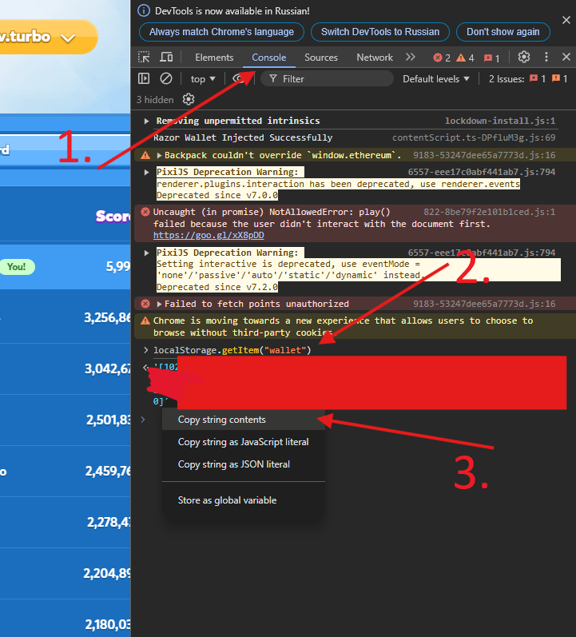

## TurboTap Eclipse

##### RPC clicker.
Made by https://t.me/glistdao

##### Features:
- Clicking

## Install

Install [python 3.12](https://www.python.org/downloads/release/python-3120/)


Linux:
```shell
python3.12 -m venv venv && \
. ./venv/bin/activate && \
pip install -r requirements.txt
```

Windows
```powershell
python -m venv venv
. .\venv\Scripts\activate
pip install -r .\requirements.txt
```

## Configuration

Provide delay between clicks and loop in `config.toml` with

start delay `clicks_delay_from`, end delay `clicks_delay_to` (between clicks);

delay between "loop" `delay_between_loop` and clicks per 1 loop `clicks_per_loop`

```toml
# config.toml

clicks_per_loop = 1000
# delay between loops in seconds
delay_between_loop_start = 800
delay_between_loop_end = 900

# delay between clicks in seconds
clicks_delay_from = 0.5
clicks_delay_to = 1
```


#### Proxies
Provide proxies in `proxies.txt` in format `http://username:password@ip:port`.

#### Wallets
Provide wallet private keys in `wallets.txt` in format `list[int]`

**How to get required private keys?**

1. Go to https://tap.eclipse.xyz/ and sign in.
2. F12 -> Console.
3. Type:
```javascript
localStorage.getItem("wallet")
```
4. Right click on response -> "Copy string contents".
5. Paste into `wallets.txt`



❗️❗️❗️ Also do a couple of hand clicks right after buying clicks.

## Run

Linux:
```shell
python3.12 src/main.py
```

Windows:
```powershell
python .\src\main.py
```

## Attention

Don't use this bot 24/7 because of anti-sybil. Let him rest :).

## Support

```
# Solana
3q87zLdFVGBh7cSUQavhK5AkdNzXyD2U7xCmB27PSBdX

# TRC20
TTHJgyn3NC69UXSzEYAvZzBbRRps9vtuZf

# EVM
0xc0fa4dcd208c7e45e2a324784526eed0fc4ef8cb
```
